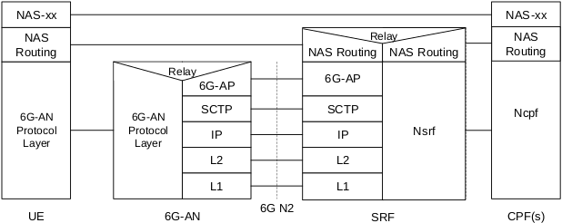
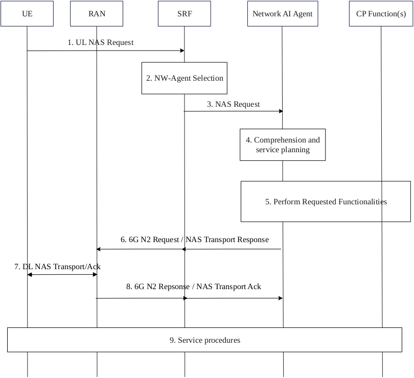
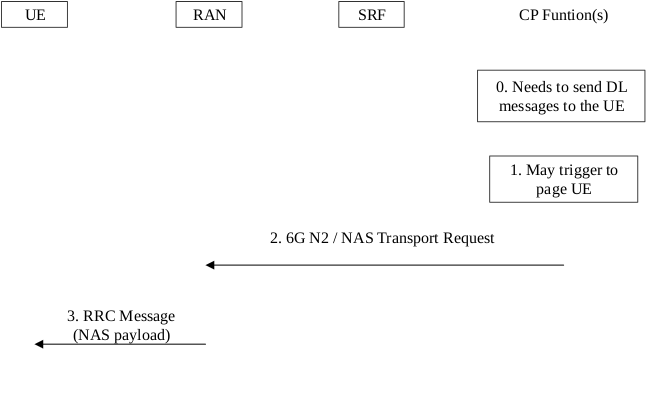
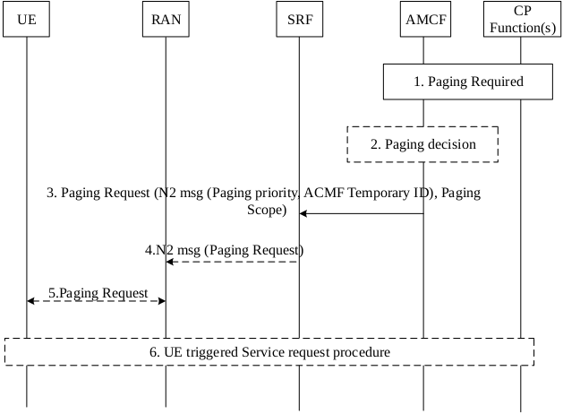
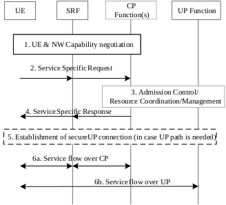

# S2-2600434

3GPP TSG-WG SA2 Meeting #173 meeting 	S2-2600434

Goa, India, 9 – 13 February, 2025	(revision of S2-250xxxx)

Source:	Huawei, HiSilicon

Title:	[KI#1] Solution #1.X: Solution for E2E control signalling in 6G system

Document for:	Approval

Agenda Item:	20.6.1

Work Item / Release:	FS_6G_ARC / Rel-20

Abstract: Propose a solution to address KI#1.

# 1. Introduction

This contribution proposes a solution on the control signalling for 6GS, to address the key issues for the WT #1.1:

Key Issue #1.1

1.	Study the support for control signalling for 6G System, including at least the following:

a.	Whether and how to enable the introduction of a new non-access stratum functionality with minimal or no impact to other non-access stratum functionalities.

Key Issue #1.2

1. 	Study the support for control signalling for 6G System, including at least the following:

a.	Whether and how to support generic mechanisms (e.g., service discovery, service authorization, transport mechanism) for UE to Core Network interaction to support operator services.

Justification for the Distributed NAS:

In 5G system, all control signallings for UE-CN interaction, e.g., messages for session management, need to go through and be handled by the AMF, which behaves as the NAS termination point for a UE. New services/features with Non-MM NAS distribution always requires AMF involvement and Non-MM functionalities has much dependency on the AMF or on NAS-MM, which results in AMF upgrade in all cases of network enhancement even there is no impact on the MM functionality. Furthermore, in the scenarios where the network provides localized services, the NAS routing always traversing the AMF is not optimal and introduces signalling detour due to that the AMF is usually deployed in a central location. MM NAS functionality should be decoupled from other Non-MM NAS functionalities.

Justification for the generic mechanisms:

So far the UE notifies its capabilities to the network but has no knowledge about what services can be provided by the network. Along with more and more operator services are to be provided by the network, it is beneficial to define a generic mechanism for service discovery, service authorization and transport mechanism between the UE and the network, e.g., for the UE to be aware of the network-provided services before invoking them, such as whether the UE can offload computing to the network, and what kind of computing services or how much computing resources can be provided by the network to the UE, etc.

Apart from addressing the above issues, taking the NAS impact of other KIs such as KI#18 into account, this paper proposes a solution with High-level principles as follows:

1.	Introduction of distributed NAS resulting in the role of the AMF in the 5GS to be split across different entities:

-	Access Management/Mobility Control Functionality

-	Signalling distribution between UE/RAN and Core Network

-	Discovery and Selection of Control Plane Function

-	Non AM/MM Functionalities

2.	Each Control Plane Function (e.g., Session Control Function, or Network AI Agent) interacting at NAS level with a UE takes the role of NAS termination point for the UE.

3.	Any NAS message may or may not carry intent information from the UE to the network.

4.	A generic mechanism over NAS for service discovery, capability negotiation and service authorization is introduced, for the UE to invoke specific service request towards the network at any time after being registered to the Core Network.

# 2. Text Proposal

It is proposed to agree the following changes vs. TR 23.801-01.

* * * * First change * * * *

## 6.0	Mapping of Solutions to Key Issues

**Table 6.0-1: Mapping of Solutions to Key Issues**

|  | Key Issues |  |  |  |  |  |  |  |  |  |  |  |  |  |  |  |  |  |  |
| --- | --- | --- | --- | --- | --- | --- | --- | --- | --- | --- | --- | --- | --- | --- | --- | --- | --- | --- | --- |
| Solutions | #1 | #Q |  |  |  |  |  |  |  |  |  |  |  |  |  |  |  |  |  |
| #X | √ |  |  |  |  |  |  |  |  |  |  |  |  |  |  |  |  |  |  |
| #Y |  |  |  |  |  |  |  |  |  |  |  |  |  |  |  |  |  |  |  |

* * * * Second change * * * *

### 6.1.X	Solution #1.X: Solution for Control signalling for 6G system

#### 6.1.X.0	Topics addressed and High-level solution Principles

This solution addresses Key issue#1: support for control signalling for 6G System. The two main features of this solution are:

-	Enables the introduction of new non-access stratum functionality with minimal or no impact on other non-access stratum functionalities.

-	Defines a generic mechanism for UE to Core Network interaction for the support of operator services.

NOTE 1:  In this solution, where “CPF” is used, it refers to any Function in Control Plane of 6G CN, including Network AI Agent.

The High-level solution Principles that this solution aims at solving are:

1.	Introduction of distributed NAS resulting in the role of the AMF in the 5GS to be split across different entities:

  a) Access Management/Mobility Control Functionality
The Access /Mobility Control Functionality is provided by a standalone Control Plane Function (CPF), named as Access and Mobility Control Function (AMCF).

  b) Signalling distribution between UE/RAN and Core Network
A light-weight core network functionality named as Signalling Routing Function (SRF) is introduced for the routing of NAS Signalling between the UE and the NAS termination points in the control plane as well as between RAN and Core Network.

    -	The SRF can forward NAS messages between the UE and multiple NAS termination points according to the configured routing rules.

    -	The NAS signalling Request message from the UE is always routed by the SRF to one of the Network AI Agents, which may further decide to invoke other CP Functions to further process the request.

    -	Other control signalling than NAS signalling Request can go via the Network AI Agent or directly between the UE and other CPFs, via the SRF, as instructed by the Network AI Agent.

    -	The SRF establishes a point-to-point (e.g., 6GAP) connection with the RAN and provides routing functions related to the 6GAP protocol.

  c) Discovery and Selection of Control Plane Function
There are two options for the discovery and selection of the Network AI Agent for the NAS signalling request message from the UE:

    -	Option 1: First selection of a default Network AI Agent by the SRF, which may further be relocated to a specific Network AI Agent by the default Network AI Agent, as needed.

    -	Option 2: Introduce a standalone Discovery and Selection Control Function (DSCF) for Network AI Agent selection.

  d) Non AM/MM Functionalities
The Non AM/MM Functionalities, such as SM subscription check, Computing service authorization, will be handled by the corresponding CP Functions.

NOTE 2:  Based on such design, there is no impact on other non-access stratum functionalities when introducing new non-access stratum functionalities.

2.	Each Control Plane Function (e.g., Session Control Function, or Network AI Agent) interacting at NAS level with a UE takes the role of NAS termination point for the UE.

3.	Any NAS message may or may not carry intent information from the UE to the network.

4.	A generic mechanism over NAS for service discovery, capability negotiation and service authorization is introduced, for the UE to invoke specific service request towards the network at any time after being registered to the Core Network.

NOTE 3:	Support of Network AI Agent is as described in the Solution x.y (Solution for KI#18), in S2-25XXXX.

#### 6.1.X.1	Description

##### 6.1.X.1.1	General

This solution proposes a signalling routing architecture covering the following cases:

1. Signalling between UE and CP Functions supporting NAS interaction with UE.

2. Signalling between 6G RAN and corresponding CP functions supporting 6GAP interaction with AN.

As shown in the Figure 6.1.X.1-1:

-	There can be multiple Control Plane Functions (CPF), such as Access and Mobility Control Function (AMCF), Session Control Function (SCF), Computing Control Function (CCF), Integrated Sensing and Communication Control Function (ISCF), Short Message Delivery Function (SMDF), Network AI Agents and so on.

NOTE 1:	The CPFs, such as Network AI Agents, SMDF are to be described by solutions in other KIs, such as KI#18, KI#15.

-	A UE may have multiple NAS interactions with CPFs for delivering operator services, e.g., Mobility Management, Session Management, Computing coordination, Agent-related interaction between UE and Core Network, etc.

-	NAS Signalling can be routed to separate NAS termination points, i.e. different CP Functions, based on the required functionality.

-	A Signalling Routing Function (SRF) is introduced to distribute signallings between UE/RAN and Core Network, especially responsible for the routing of NAS Signallings between UE and each Control Plane NAS Termination point.

  For the signalings between UE and Core Network, the SRF can forward NAS messages to multiple NAS termination points according to the configured routing rules.

-	When receiving a UE initiated NAS request message (with or without intent included) for a specific service, the SRF will select a Network AI Agent as NAS termination point (optionally via DSCF).

NOTE 2:	When the network has Agentic capabilities, the UE initiated NAS request messages are always routed to a Network AI Agent, which can comprehend the intent and program the network functionalities to fulfil the requested service.

UERANSRFToolsUE initiated NAS Request messages to Network AI AgentsNAS messagesUERANSRFToolsUE initiated NAS Request messages to Network AI AgentsNAS messagesCPF (6G AM)CPF (6G AM)ToolsToolsToolsToolsCPF (6G SM)CPF (6G SM)CPF (6G xNF)CPF (6G xNF)

CPFs(Network AI Agents)CPFs(Network AI Agents)

Dashed lines: Decided by Network AI Agents if the messages go directly over these paths.Dashed lines: Decided by Network AI Agents if the messages go directly over these paths.

Figure 6.1.X.1.1-1: Architecture for signaling distribution between UE/RAN with CP Functions

For AN-CN signalling,

- AN establishes point-to-point connection with SRF (e.g., using SCTP and ‘6GAP’).

Figure 6.1.X.1.1-2 shows an example of the control plane protocol stack between the UE and the CPF(s).

Figure 6.1.X.1.1-2 Example of control plane protocol stack between UE and CPF

Figure 6.1.X.1.1-3 shows an example of multiple NAS terminations.

AN LayerAN Layer6G UE6G RANSRFCPF(s)NAS Routing layerNAS Routing layerIntentNAS NASSM NASMM NASIntentNASSM NASMM NAS    NAS Routing layerAN LayerAN Layer6G UE6G RANSRFCPF(s)NAS Routing layerNAS Routing layerIntentNAS NASSM NASMM NASIntentNASSM NASMM NAS    NAS Routing layer

Figure 6.1.X.1.1-3 Example of multiple NAS termination points

The NAS signalling can carry intent information, e.g. within a stand-alone NAS request to enable intent-based communications. Each CP Function, e.g., 6G MM, SM, Policy, Computing Control Function, Network AI Agents, or any other service function, maintains an overlay association with the UE over the underlay association between the UE and the SRF, at service transaction granularity. Multiple associations can be maintained between the UE and the same CP Function simultaneously.

NOTE 3: The NAS protocol related aspect, such as how to transfer the intent, can be further discussed in Stage 3.

NOTE 4: The detailed mechanisms of intent-based communication are described in the solutions for KI#18.

6.1.X.1.2	Routing functionality

There are two options for the routing functionality in the SRF.

Option 1: The SRF is context based, i.e. the SRF stores the routing information for a UE.

UE6G RANSRFCP Function(s)6G RNTIUE 6GAP IDService Context ID(s)Service Session ID(s)SRF GUTI/S-TMSIUE6G RANSRFCP Function(s)6G RNTIUE 6GAP IDService Context ID(s)Service Session ID(s)SRF GUTI/S-TMSI

Figure 6.1.X.1.2-1: Association of the UE Identifiers with context based SRF

When SRF is context based, a globally unique temporary identifier (GUTI) is assigned per each UE by the SRF, named as SRF GUTI, which contains S-TMSI (S-Temporary Mobile Subscriber Identity), and the RAN node can send the NAS request containing the SRF GUTI or S-TMSI from the UE to the SRF which stores the UE routing information.

Besides the SRF GUTI, a set of hop-by-hop identifiers consisting of RNTI, 6G NGAP UE ID and Service Context ID, and Service Session ID need to be assigned to associate the messages between the termination points of each hop:

-	Between the UE and 6G RAN node, 6G RNTI (radio network temporary identifier) is assigned by the 6G RAN to the UE, and can be further mapped into a specific UE 6GAP ID used between 6G RAN and SRF. Based on the stored mapping relation and the 6G RNTI or UE 6GAP ID carried in the message, the 6G RAN node sends the NAS signalling between the UE and the SRF, and sends/receives the N2 messages to/from the SRF in case the signalling is initiated by the 6G RAN.

-	Considering there might be multiple session associations between UE and one or more CP Functions, a Service Session ID for the UE needs to be assigned to identify each session association between the UE and one type of CP Function, which can be utilized by the SRF to map the control signalling between the UE and the CP Function for the session association, or to route the control signalling between 6G RAN and the CP Function in case the signalling is initiated by the 6G RAN.

-	To identify the association between SRF and CP Function for each service transaction, a Service Context ID is assigned between the SRF and each CP Function which has association with the UE and/or RAN nodes. Based on the Service Context ID association and/or the UE 6GAP ID and Service Session ID(s) carried in the messages, the SRF routes the NAS message between the UE and the CPF, and routes the N2 message between the RAN and the CPF.

NOTE 1: In this option, it is assumed Service Session ID(s) of NAS for different kinds of service have the same format in 6G for the SRF to have a unified routing table format.

Option 2: The SRF is contextless based, i.e. the SRF does not store any routing information for a UE.

UE6G RANSRFCP Function(s)6G RNTIUE 6GAP ID(s)Service Session ID(s)CPF ID(s)UE6G RANSRFCP Function(s)6G RNTIUE 6GAP ID(s)Service Session ID(s)CPF ID(s)

Figure 6.1.X.1.2-2: Association of the UE Identifiers with contextless based SRF

When SRF is designed as contextless based, a globally unique CPF ID, is provided by each CPF to the RAN and/or the UE for the UE context association after first round communication. The RAN node can send the NAS request containing the CPF ID from the UE to any SRF, and the SRF routes the request to the corresponding CPF.

Besides the CPF GUTI, a set of identifiers consisting of RNTI, 6G NGAP UE ID and Service Session ID need to be assigned to associate the signalling messages between the termination points with RAN and UE:

-	Between the UE and 6G RAN node, 6G RNTI (radio network temporary identifier) is assigned by the 6G RAN to the UE, and can be further mapped into a set of specific UE 6GAP ID used between 6G RAN and each CPF. Based on the stored mapping relation and the 6G RNTI or UE 6GAP ID carried in the message, the 6G RAN node routes the NAS signalling between the UE and the CPF via any SRF.

-	To identify the association between CP Function and the UE for each service transaction and the relation between CP Function and the RAN for each UE, there is a mapping association between RAN UE 6GAP ID for each CPF and the CPF ID and Service Session ID in both the RAN and the CPF, so that both the RAN and CPF are able to find the corresponding UE context for each Service Session, when receiving the messages from each other.

NOTE 2:	“CPF UE 6GAP ID” is NOT required as its functionality to identify a specific UE context is fulfiled by CPF ID and Service Session ID. In other words, the CPF/Service Context ID is kind of “CPF UE 6GAP ID”.

NOTE 3:	Considering topology hiding, the CPF ID sent to UE/RAN can be an alias, which has a N to 1 mapping with real CPF FQDN.

> Editor’s note: Structure for the UE NAS Identifiers are FFS.

> Editor’s note: Whether the Service Session ID(s) need to be assigned by the UE or by the Core Network NF (SRF or CPF(s)) are FFS.

##### 6.1.X.1.3	NAS security termination point

There are two options for the NAS security termination point:

Option 1: Single NAS security termination point

The SRF acts as security termination point towards the UE, and is responsible for the encryption and integrity protection of NAS signalling. There is a single UE security context in both the UE and the SRF.

Option 2: Distributed NAS security termination point

Each CPF acts as security termination point towards the UE, and is responsible for the encryption and integrity protection of NAS signalling.

NOTE:	Details of NAS security aspects are to be investigated by SA3.

##### 6.1.X.1.4	Discovery and Selection of CP Functions

When a new NAS functionality is introduced, to avoid the potential impacts on other NAS functionalities, there are two options for Discovery and Selection of the corresponding CP Function which can provide the new functionality:

Option 1: For the initial CPF selection, a default CPF, i.e. a default Network AI Agent, is selected by the SRF. If the default Network AI Agent is not appropriate to serve the request, the default Network AI Agent performs reallocation.

Option 2: A standalone Discovery and Selection Control Function (DSCF) can be introduced for the discovery and selection of the target Network AI Agent function.

The parameters for Network AI Agent selection by SRF or DSCF may include:

-	NAS request message type, e.g., ‘SM’ for Session Control, ‘Intent’ for Intent based service.

NOTE:	Details of NAS request message type has dependency on solutions for other KIs, such as KI#18, KI#20, KI#21, KI#22.

The parameters for Network AI Agent selection by default Network AI Agent or DSCF may include:

-	Parameters from UE Subscription, e.g., MPS.

-	N2 related parameters from RAN, e.g., ULI.

-	Other service related parameters, e.g., DNN.

##### 6.1.X.1.5	Generic mechanism for interaction between UE and Core Network for operator services

To invoke the operator services, two-phase interaction is described as below:

- Control signalling is transmitted between the UE and CP Function via control plane, for the purpose of e.g. service discovery, authorization, invocation, or capability negotiation between the UE and Core Network.

- Service data can be transmitted between the UE and CP Function or UP function as needed, e.g., SMS over NAS message between the UE and SMDF via control plane, or computing service data over user plane..

- During the service data transmission, if further service level control signalling needs to be exchanged between the UE and the CP Function(s), the signalling messages are transported over CP, i.e. over NAS.

#### 6.1.X.2	Procedures

##### 6.1.X.2.1	Generic Procedure for interaction between UE and Network AI Agent

This procedure describes the call flow when the UE initiates a NAS request, e.g. Registration, Session Establishment, any MO request. The UE sends the request to the Network AI Agent via the SRF. After fulfilment of the request from the UE, the Network AI Agent responds to the UE request, and may also send instructions to the RAN, e.g. for QoS control. The Network AI Agent may decide to instruct other CPFs to further handle the UE request.

Figure 6.1.X.2.1-1: Service invocation procedure between UE and Network AI Agent

1.	The UE sends NAS Request to the Core Network, in which the UE may request for registration to the network, or once registered in the network, request the service invocation for connectivity services (e.g., QoS guarantee required) or other operator services (e.g., computing offload required).

NOTE: The UE NAS request may or may not include an intent.

2.	When receiving the UL NAS message, the SRF performs Network AI Agent selection, e.g., based on the NAS message type and the location of the UE, if applicable.

3.	The SRF forwards the NAS request to the selected Network AI Agent.

4.	The Network AI Agent may perform comprehension and service planning based on the request from the UE.

> Editor’s note: How the Network AI Agent performs intent comprehension and service planning needs to be coordinated with solutions for KI #18.

5.	The Network AI Agent may interact with other CPF(s) for service invocation, or send the NAS request from the UE to other CPF(s) for further handling, as decided by the Network AI Agent.

6.	In case the Network AI Agent determines that 6G N2 and/or NAS response message(s) to the service invocation needs to be transmitted, it invokes the 6G N2 Request and/or NAS Transport Response to the SRF, and the SRF further routes the message to the RAN node.

7.	The RAN node forwards the NAS message to the UE. The UE responds to the NAS message if required.

8.	The RAN node responds to the SRF with Acknowledgement from the UE, and the SRF further forwards the Acknowledgement to the Network AI Agent.

9.	Subsequent service procedures between UE and CP functions, as needed.

##### 6.1.X.3.2	Generic MT service establishment procedure for interaction between UE and Core Network

This procedure describes the call flow when there is a MT request from the CPF to the UE, e.g., the Network AI Agent needs to send request to the UE, and the Network AI Agent will trigger paging procedure if the UE is in CM-Idle, and sends the MT request to the UE when the UE becomes CM-Connected.

Figure 6.1.X.2.2-1: MT service establishment procedure

0.	When a CPF (support of any operator service, e.g., connectivity, location service, sensing, Network AI Agent, computing, etc.) needs to send downlink message to the UE and the serving RAN of the UE, the CPF decides the downlink routing info, e.g. based on the Service Context ID of the SRF, in case the SRF is context based.

1.	If the UE is in CM_IDLE, the CPF may trigger paging of UE as described as clause 6.1.x.2.3.

2.	The CPF sends 6G N2 and/or NAS Transport Request to the RAN via the SRF.

3.	The RAN sends AN message (NAS payload) to the UE .

##### 6.1.X.2.3	Paging Procedure

This procedure describes the call flow when there is control plane signalling or user plane downlink data delivery from the network to the UE, while the UE is in CM-Idle state. The CPF sends request to the AMCF and the AMCF decides to send paging request to the RAN via the SRF. After the procedure, the UE becomes connected.

Figure 6.1.X.2.3-1: Paging procedure

1.	The CP Function(s) needs the transmission of control plane signalling or user plane downlink data delivery to CM-Idle UEs.

2.	Upon receiving the request message from the CPF, the AMCF may interact with the Network AI Agent to decide on paging for the UE, and identifies the target RAN based on the mobility pattern of the UE, e.g., last visited TAI, cell, etc, and selects appropriate SRF instance.

3.	The AMCF function sends a Paging request message to the selected SRF, which contains the paging parameters,  such as 6G NR to be paged in paging scope, together with the N2 message which may contain Paging priority and AMCF temporary ID assigned by the AMCF during registration procedure.

4.	The SRF sends the N2 message to these selected RAN.

5.	RAN performs the paging operation, e.g. broadcasting the paging message.

6.	Upon reception of paging request, the UE initiates the RRC connection establishment procedure and transitions to the connected state to resume signalling interaction, and performs the UE-triggered Service Request procedure towards the Core Network to resume the subsequent data transmission as described in clause 6.1.x.2.1.

NOTE:	The AMCF may send paging request to multiple RAN node, based on paging scope.

##### 6.1.X.2.4	Generic procedure for interaction between UE and Core Network to support operator services

This procedure describes the call flow for a generic mechanism over NAS for service discovery, capability negotiation and service authorization before the UE initiates request for a specific service. The UE invokes service specific capability negotiation with the network at any time after being registered to the Core Network, and once being authorized, the UE may send service specific request to the CPF.

Figure 6.1.X.2.4-1: Generalized procedure for interaction between UE and CN Function(s) for operator services

1.	The UE may invoke the service specific capability negotiation with the network at any time after being registered to the Core Network.

2.	After being authorized or negotiated successfully, the UE may send service specific request to the CP Function(s) as described in clause 6.1.x.2.1.

3.	The CP Function(s) performs the admission control, resource coordination/management for the UE, and determines whether UP path is needed. If UP path is needed, UP related information will be provided to the UE, e.g. the Network AI Agent instructs the SCF to provide the UP related information to the UE.

4.	The CP Function(s) acknowledges the request message.

5.	If UP path is needed, the CPF triggers the establishment of secure UP connection to the Core Network.

6a.	In case the service data need to be transmitted via control plane, the UE then send the service data flow via SRF to the CP Function.

6b.	In case the service data need to be transmitted via user plane, the UE sends the service data flow towards the UP function.

During the service data transmission, if further service level control signalling needs to be exchanged between the UE and the CP Function(s), signalling messages are transported over NAS, e.g. the UE sends another service request, as in step 2.

#### 6.1.X.3	Services, Entities and Interfaces

New CP Function:

  -	CP Functions: Access and Mobility Control Function (AMCF), Session Control Function (SCF), Computing Control Function (CCF), Integrated Sensing and Communication Control Function (ISCF), Short Message Delivery Function (SMDF), Network AI Agents.

  -	SRF: Signalling Routing Function.

  -	DSCF: CPF Discovery and Selection Control Function.

CP Functionalities:

  -	SRF:

  - UE NAS Security Context

> Editor’s Note: UE NAS Security Context in the SRF is needed in case of Single NAS Security termination point. Whether NAS security Context in the SRF is needed in case of Distributed NAS security termination point, e.g. if the NAS header needs to be encrypted, is to be investigated by SA3.

  - Routing Information (In case of context based SRF): SRF GUTI/S-TMSI, 6GAP UE ID, Service Context ID(s), Service Session ID(s)

  -	CPF(s):

  - NAS Security Context (In case of Distributed NAS security termination point).

  - Routing Information:

  - Service Context ID(s), Service Session ID(s) (In case of context based SRF)

  - RAN 6GAP UE ID, Service Session ID(s) (In case of contextless based SRF)

  -	New interface between SRF and CPF: Nxx, used for routing NAS/ N2 messages.

RAN:

  -	For UE related functionalities, RAN stores 6G RNTI, and may store routing info (SRF GUTI/S-TMSI and UE 6GAP ID (In case of context based SRF) Or CPF ID(s) and Service Session ID(s) (In case of contextless based SRF)) per UE service when UE is in CM_CONNECTED.

-	For node level functionalities, RAN sends the node level information to the SRF.

UE:

  -	UE stores routing info per UE service when the UE is in CM_CONNECTED and CM_IDLE: 6G RNTI, Service Session ID(s), SRF GUTI/S-TMSI (In case of context based SRF) or CPF ID(s) (In case of contextless based SRF).

  -	Single NAS security context (In case of Single NAS Security termination point) or Distributed NAS security context(s) (In case of Distributed NAS security termination point).

* * * * End of changes * * * *
