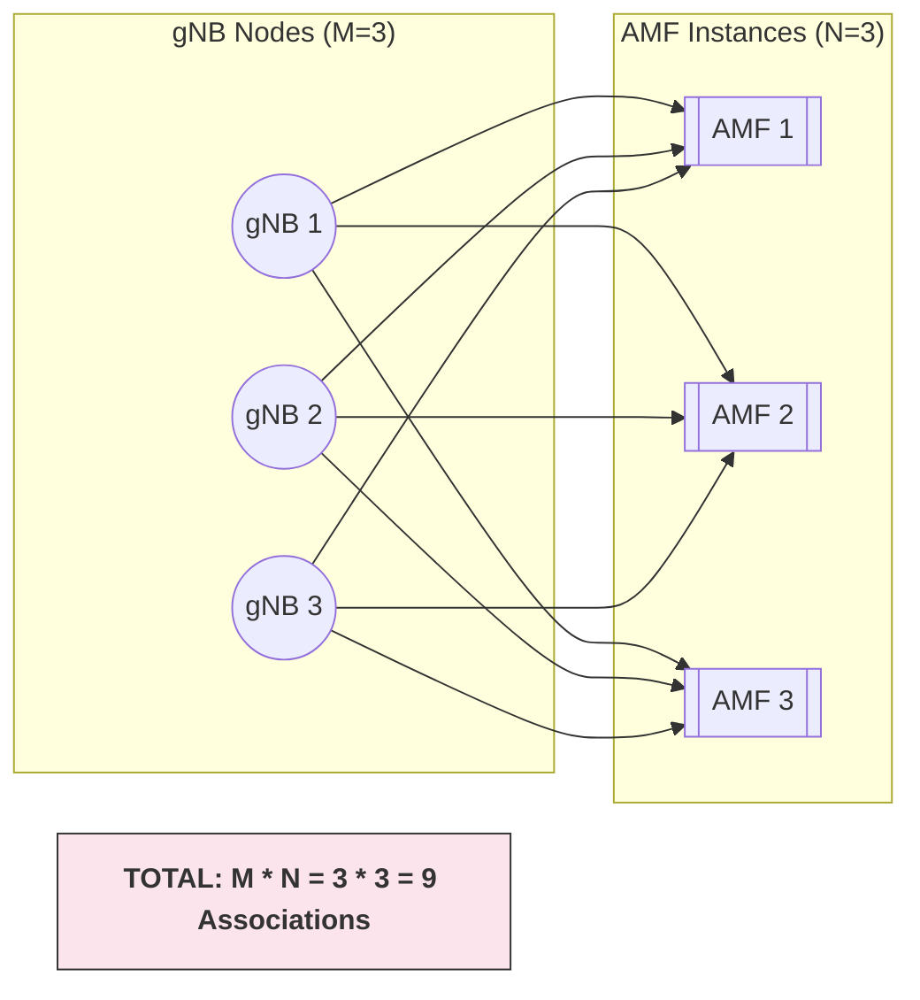
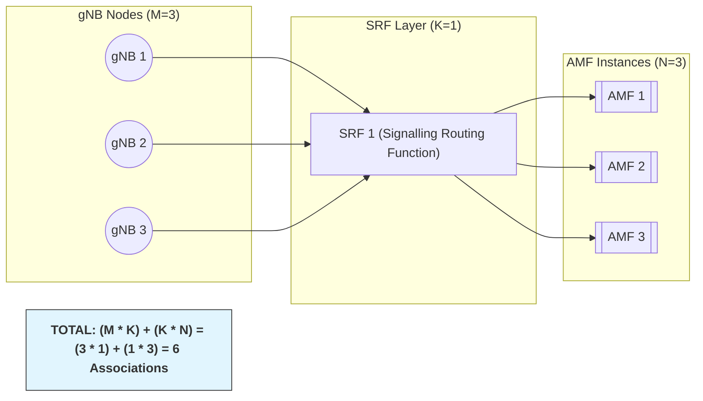

# 潜在的收益来源

SRF部署方案相比5GC AMF Pool部署方案，SCTP/NGAP链路数会显著减少：

1. 维护SCTP/NGAP链路的**基本消耗**减少（如心跳、定时器、收发缓冲区等）
2. 维护SCTP/NGAP链路的**冗余资源**减少（AMF Pool方案任意AMF和基站全互联，可能存在较多冗余）

收益估算：能省多少虚机、vCPU、内存？

## SCTP/NGAP链路数

### 5GC组网

- 假设M为基站数量
- 假设N为AMF数量
- 总的连接数 = $M \times N$，基站和AMF全互联

### SRF组网

- 假设M为基站数量
- 假设N为AMF数量
- 假设K为SRF数量（SRF不需要组Set，K<<N）
- 总的连接数 = $M \times K + K \times N$，基站和SRF全互联

## AMF Pool冗余

### 介绍

容灾模式分为1+1主备、1+1互备、组Pool和多DC N way四种方式，AMF采用 组Pool这种方式。

AMF Pool特性是多个AMF同时为相同的无线区域服务（AMF Pool区），Pool内AMF与Pool区内所有gNodeB互联，Pool内AMF之间实现资源共享，业务**负荷分担**。UE接入哪个AMF与gNodeB的负荷均衡策略有关，因此gNodeB需感知AMF的设备状态。如果探测到AMF不可用，需要及时调整负荷均衡策略，将新接入业务请求消息分配给其它正常状态的AMF。另外，gNodeB需获取AMF的负荷权重，结合负荷权重来为UE选择接入的AMF。使用AMF Pool部署网络，可以提高网络可靠性。

### 冗余量计算

假设AMF Pool中共有N个AMF，总负载为 $L$

- **正常情况:** 每个AMF的负载为 $\frac{L}{N}$.
- **异常情况 (1 node down)**: 每个AMF的负载为 $\frac{L}{N-1}$.

每个AMF要承担的额外的冗余负载为:

$$
\text{每个AMF冗余负载} = \frac{L}{N-1} - \frac{L}{N} = \frac{L}{N(N-1)}
$$

## SRF部署方案

### 容灾方案

假设SRF采用1+1主备或互备容灾，部署2个SRF网元实例，承担用户业务。

### 冗余量计算

假设总负载为 L：

- 正常情况：2个SRF均正常，各承担 **$\frac{L}{2}$** 或 50%的业务
- 异常情况：1个SRF故障，剩下的SRF必须承担所有业务(**$\frac{L}{1}$** 或 100%)

1+1冗余方案相比AMF Pool方案，在冗余量上反而更多，没有优势。

# SRF方案性能收益计算

## 分析基线

以UNC AMF 25.1 中国移动ARM虚机部署目标为基线进行分析：

| VM/POD            |   Core | 内存   | 存储   | 动态规格 | 规格        | N       | M     | N+M    | 总core  | 总内存  | 总存储  | 占比CPU   | 占比内存  | 占比存储  |
| ----------------- | -----: | ------ | ------ | -------- | ----------- | ------- | ----- | ------ | ------- | ------- | ------- | --------- | --------- | --------- |
| OMU_ARM           |     12 | 68     | 350    |          |             | 1       | 1     | 2      | 24      | 136     | 700     | 5.0%      | 7.8%      | 28.6%     |
| PBU_C2-A_ARM      |     12 | 44     | 38     | 447      | 447         | 9.0     | 3     | 12     | 144     | 528     | 456     | 29.8%     | 30.4%     | 18.6%     |
| **PBU_C2-A1_ARM** | **12** | **32** | **38** | **447**  | **447.165** | **9.0** | **3** | **12** | **144** | **384** | **456** | **29.8%** | **22.1%** | **18.6%** |
| PBU_C-A3_ARM      |      8 | 18     | 28     | 6400     | 6400        | 0.7     | 1     | 2      | 16      | 36      | 56      | 3.3%      | 2.1%      | 2.3%      |
| PBU_I-G1_ARM      |      8 | 26     | 30     | 1019     | 1018.98     | 4.0     | 2     | 6      | 48      | 156     | 180     | 9.9%      | 9.0%      | 7.4%      |
| PBU_M2_ARM        |      6 | 40     | 32     | 1340     | 1339.5      | 3.0     | 1     | 4      | 24      | 160     | 128     | 5.0%      | 9.2%      | 5.2%      |
| PBU_M-G1_ARM      |      8 | 24     | 32     |          |             | 3       | 0     | 3      | 24      | 72      | 96      | 5.0%      | 4.1%      | 3.9%      |
| OMU_L1_ARM        |      4 | 26     | 40     |          |             | 1       | 1     | 2      | 8       | 52      | 80      | 1.7%      | 3.0%      | 3.3%      |
| PBU_L_ARM         |      4 | 24     | 32     |          |             | 1       | 1     | 2      | 8       | 48      | 64      | 1.7%      | 2.8%      | 2.6%      |
| PBU_L-M_ARM       |      4 | 22     | 26     |          |             | 1       | 1     | 2      | 8       | 44      | 52      | 1.7%      | 2.5%      | 2.1%      |
| PBU_I2_ARM        |      6 | 20     | 30     | 1083     | 1083        | 3.7     | 2     | 6      | 36      | 120     | 180     | 7.4%      | 6.9%      | 7.4%      |
| 总计              |        |        |        |          |             |         |       | 53     | 484     | 1736    | 2448    | 100%      | 100%      | 100%      |

动态规格：指不出告警的情况下，用户容量最多能到多少

## 计算方式一：考察PBU_C-A1

### SRF类比PBU_C-A1

从AMF外部视角来看，AMF负责：

1. 管理SCTP链路
2. 管理NGAP链路
3. 承担具体的业务功能（如各种标准流程）

但从AMF内部来看，SCTP和NGAP链路管理由相对独立的2个服务承担：`LINK + NGECM`，对应的虚拟机类型是`PBU_C-A1`。

换一种角度理解SRF：SRF方案提供的链路相关的主要功能 即 原先AMF网元内的、由`PBU_C-A1`承载的功能，将PBU_C-A1迁移到了AMF网元外 就能得到SRF。

**可以根据SRF目标部署方案下，相比5GC AMF Pool方案`PBU_C-A1`数量减少情况来计算性能收益。**

### 收益数学模型

**1. 变量:**

* $M$: Total RAN nodes.
* $N$: Total AMF instances.
* $K$: Total SRF instances.
* $V_{5G}$: The total number of PBU_C-A1 instances currently running in 5GC pool.

**2. 链路数**

* **5GC部署方案 ($L_{5G}$):** $M \times N$
* **SRF部署方案 ($L_{6G}$):** $(M \times K) + (K \times N)$

**3. 优化的链路数占比 ($\rho$):**

$$
\rho = \frac{L_{5G} - L_{6G}}{L_{5G}}
$$

**4. 收益:**

$$
\text{VMs Saved} = V_{5G} \times \rho
$$

### 结论

- 基站数量 M = 150000，目前AMF的规格是40W基站（中国移动+广电），但一般的大型局点最多也就15W站
- Pool内 AMF 实例个数 N = 6：跟维护同事确认，国内大的局点Pool内有12套AMF，国外一般的局点仅2 套AMF。
- SRF 个数 K = 2：SRF采用1+1主备或互备：
- $V_{5G}$ = 72，每个AMF有12个 PBU_C-A1 虚机，整个AMF Pool共72个

---

将以上数值代入公式试算，得到在上述前提（基站数量 、AMF实例数等）下的收益：

* 链路数减少：599988，66.7%
* PBU_C-A1虚机节省：47个
* CPU Core减少：564个
* 内存减少：1504GB
* 存储减少：1786GB

---

整体收益：

- 整个AMF 虚机数量减少14.8%
- 总CPU减少19.4%
- 总内存减少14.4%
- 总存储减少12.2%

在线计算器：[6G SRF Architecture Performance Calculator](http://101.245.78.174:7102/)

## 计算方式二：从链路维护本身的开销出发

### SRF 功能细分

`SRF`  的主要消耗有2部分：

1. **SCTP/NGAP 消息转发**，资源消耗占绝大部分
2. **SCTP/NGAP 链路维护**，资源消耗占一小部分

由于 SRF 目标部署方案不影响业务量，因此**SCTP/NGAP消息转发**这部分的消耗不会有所改变，下面重点考察**SCTP/NGAP 链路维护**部分的资源消耗情况：CPU+内存

1. CPU资源的消耗可以忽略不计（根据实验室数据，标准话务模型下、只建链、不跑业务时AMF相关虚机的CPU使用率仅上涨2%左右），心跳、核查等动作CPU消耗不明显
2. 内存资源的消耗主要包括：SCTP收发缓冲区、DB记录、NGECM上的领域数据，还包括一些暂态的TCB参数（如Seq Num, ACK Num, 拥塞控制窗口等）

估算：单条SCTP/NGAP链路消息消耗内存 156KB

### 收益数学模型

**变量：**

* **$M$**: Total number of RAN nodes (gNBs).
* **$N$**: Total number of AMF instances in the AMF Pool.
* **$K$**: Total number of SRF instances. For a 1+1 redundancy model, **$K = 2$**.
* **$L$**: Total signalling traffic (messages per second) from the RAN.
* **$C_{link}$**: The resource cost (CPU cores and RAM) to maintain **one** idle SCTP/NGAP connection.
* **$C_{msg}$**: The resource cost to route/forward **one** NAS message.

**5GC AMF Pool方案：**

* **Total Links:**$M \times N$
* **Total Message Cost:**$L \times C_{msg}$
* **Total Resource Cost (**$R_{5G}$**):**
  $$
  R_{5G} = (M \times N \times C_{link}) + (L \times C_{msg})
  $$

**SRF部署方案**：

* **Total Links:**$(M \times K) + (K \times N)$
* **Total Message Cost:**$L \times C_{msg}$ (The active SRF forwards all **$L$** messages; standby forwards 0. Total cost is identical).
* **Total Resource Cost (**$R_{6G}$**):**
  $$
  R_{6G} = (((M \times K) + (K \times N)) \times C_{link}) + (L \times C_{msg})
  $$

$$
\Delta_{Gain} = R_{5G} - R_{6G}
$$

$$
\Delta_{Gain} = C_{link} \times [ (M \times N) - (M \times K) - (K \times N) ]
$$

### 结论

- 基站数量 M = 150000，目前AMF的规格是40W基站（中国移动+广电），但一般的大型局点最多也就15W站
- Pool内 AMF 实例个数 N = 6：跟维护同事确认，国内大的局点Pool内有12套AMF，国外一般的局点仅2 套AMF。
- SRF 个数 K = 2：SRF采用1+1主备或互备：
- 单链路内存消耗：157KB
- 单链路CPU消耗：0.0001 Core，几乎可以忽略不计；

将以上数值代入公式计算，得到在上述前提（基站数量、AMF实例数等）下的收益：

- 链路数减少：599988
- 内存减少：89.26GB
- CPU Core减少：60个
- PBU_C-A1减少：2个

在线计算器：[6G SRF Architecture Performance Calculator](http://101.245.78.174:7102/)

SRF部署方案能显著节省基站链路数，但其无法减少消息量，而链路维护本身开销极小，因此最终的收益不明显。

<!-- # 其它简化未考虑的因素 -->